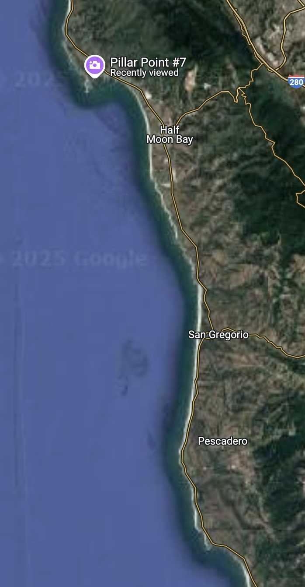

# Basic markdown (.md) file formatting
[Basic instruction for creating repository with an .md (markdown) file](#basic-instruction-for-creating-repository-with-an-md-markdown-file)  \
[Formatting for a GitHub markdown file](#Formatting-for-a-github-markdown-file)  \
-[Text](#text)  \
-[Headers](#headers)  \
-[Emphasis- bold, italics](#emphasis)  \
-[Lists and bullet points](#lists-and-bullet-points)  \
-[Table of contents](#table-of-contents)  \
-[Images](#images)  
-[Links to resources](#links-to-resources)

## Basic instruction for creating an .md (markdown) file on GitHub
Within a repository, we make, store, edit markdown files which help us keep track of our pipeline, code, results, other documents, other folders of documents. 

To make a markdown file, click on the "Add file" at the top right of the inner window. This will open a fresh file where you can compose your new file. This can be a markdown file, straight code, etc. 

You will want to name your file with a `.md` at the end of the name in the open field at the top.

This is also, where you can make the folder in the repo where you want this .md file stored. you do this by first typing the name of the desired folder, then a `/` then the name of your .md

A markdown file helps to keep track of your pipeline and parameters you used so that it is reproducible. **It is only as good as the extent to which you document it.** 

## Editing an .md file and "commiting changes"
Now that we have a new .md file, before we get into formatting, the green Commit Changes button at the top right is key. Once you have written something in the window, click commit changes, and then if you wish, add a note about what you did to the doc, and then click commit changes again. You will see the fruits of what you have written in html format. This act of commiting changes essentially functions as a `Save` button. If you close the window with out commiting changes, you will lose whatever you just did before the most recent "Commit Changes". If you want to edit again, click on the pen icon at the top right. 

## Formatting for a GitHub markdown file
*For all formatting examples, if possible I will put what is typed into the codespace as well as what that looks like once we commit changes.*
### Text
Normal text can be written, well, normally

    Normal text can be written, well, normally

If you want lines of text the stack,  
then you need to put either  
two spaces then enter or \ followed by `enter`\
to denote where we would usually put `enter`
If we don't do either of these
and just hit enter, 
it will look alright in the edit window 
but will string together in the html. 

        If you want lines of text the stack,  
        then you need to put either  
        two spaces then enter or \ followed by `enter`\
        to denote where we would usually put `enter`
        If we don't do either of these
        and just hit enter, 
        it will look alright in the edit window 
        but will string together in the html. 

To put anything in codespace window, you just indent those lines one or more tabs:

        To put anything in codespace window, you just indent those lines one or more tabs:
If you have many lines of code you want in codespace, highlight the whole block and hit `tab` or `command ]` to indent/put it in code space it all at once.

To put `filenames` or short lines of code into `code font` you add ticks around it. This has to be the tick marks found on the same key as the tilda `~`. 

        To put `filenames` or short lines of code into `code font` you add ticks around it.

*tip: if its code you are putting in codespace, use just one tab. Later if you want to copy that code from the codespace window, you won't have to delete the extra tab at the begininning of each line.
### Headers
    # H1
    ## H2
    ### H3
    #### H4
    ##### H5
    ###### H6
# H1
## H2
### H3
#### H4
##### H5
###### H6

### Emphasis

Italics with *asterisks* or _underscores_. \
Bold, with double **asterisks** or double __underscores__. \
Combine with **asterisks and _underscores_**. \
Strikethrough with two tildes. ~~Scratch this.~~

    Italics with *asterisks* or _underscores_.

    Bold, with double **asterisks** or double __underscores__.

    Combine with **asterisks and _underscores_**.

    Strikethrough with two tildes. ~~Scratch this.~~

### Lists and bullet points

1. First list item
2. Another item
      * Unordered sub-list.
      * Unordered list can use asterisks
           - Or minuses
           + Or pluses
           * All will be bullet points
1. Actual numbers don't matter, just that it's a number
      1. Ordered sub-list
      2. Second item
4. And another item.

   You can have properly indented paragraphs within list items. Notice the blank line above, and the leading spaces (at least one, but we'll use three here to also align the raw Markdown). \
   To have a line break without a paragraph, you will need to use two trailing spaces or a `space \`.  
   Note that this line is separate, but within the same paragraph.  

        1. First ordered list item
        2. Another item
        [tab] * Unordered sub-list.
              * Unordered list can use asterisks
                    - Or minuses
                    + Or pluses
                    * All will be bullet points
        1. Actual numbers don't matter, just that it's a number
        [spaces]1. Ordered sub-list will change this 1 to i 
        [spaces]2. Ordered sub-list will change this 2 to ii
        4. Another item.
  
      [3spaces]You can have properly indented paragraphs within list items. Notice the blank line above, and the leading spaces (at least one, but we'll use three here to also align the raw Markdown). \
      To have a line break without a paragraph, you will need to use two trailing spaces or a `space \`.[2spaces]
      Note that this line is separate, but within the same paragraph.[2spaces]
  
### Links
There are two ways to create links.
1. Hyperlinked text:  
    [hyperlinked text to CCH2](https://www.cch2.org/portal/collections/search/index.php)  
2. plain ol' URLs in angle brackets will automatically get turned into links.  
https://sbbotanicgarden.org/ or <https://sbbotanicgarden.org/>  

        1. Hyperlinked text: 
            [hyperlinked text to CCH2](https://www.cch2.org/portal/collections/search/index.php)  
        2. plain ol' URLs in angle brackets will automatically get turned into links.  
        https://sbbotanicgarden.org/ or <https://sbbotanicgarden.org/>
   
### Table of contents
Similar to linking but within your doc. The format is:  
`[whatever text you want in table](#exact-text-you-want-to-link-to-no-caps-no-symbols-dash-separated)`

[Top of page to Basic instruction](#basic-instruction-for-creating-repository-with-an-md-markdown-file)

### Images
``  

    Here is a .jpg:
    
    
Here is a .jpg:
  

### Links to resources

Emojis: https://gist.github.com/rxaviers/7360908  

There is a lot more formatting you can do: check out https://github.com/adam-p/markdown-here/wiki/markdown-cheatsheet where a lot of this came from.
